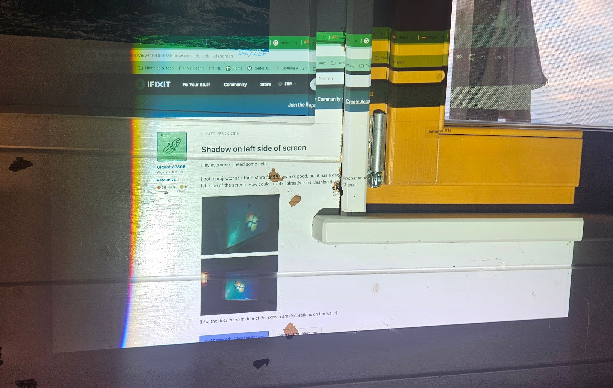
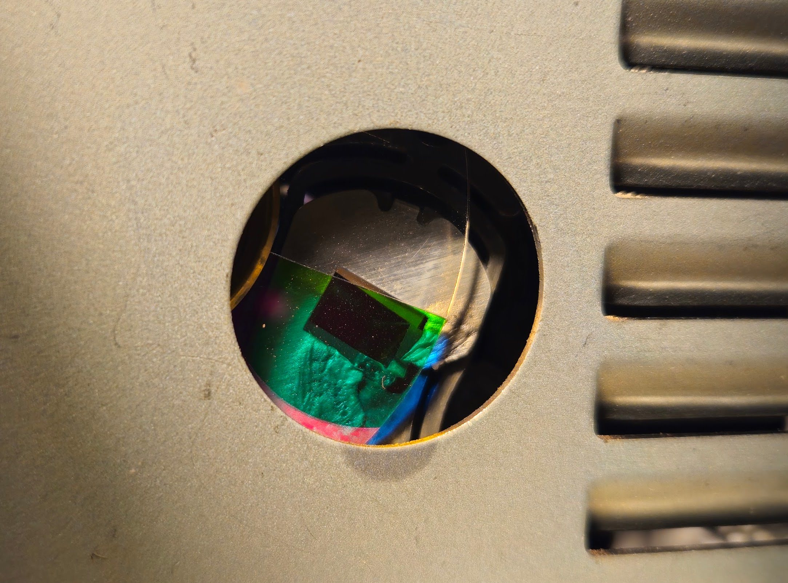
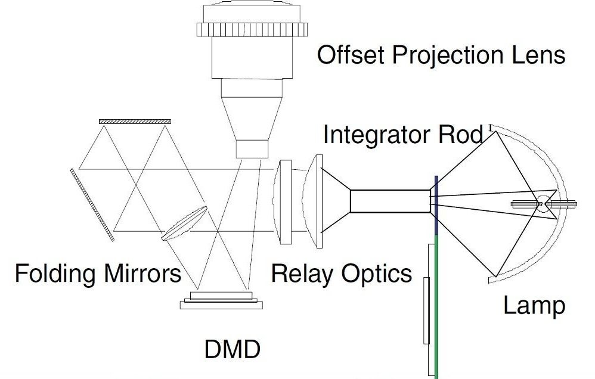
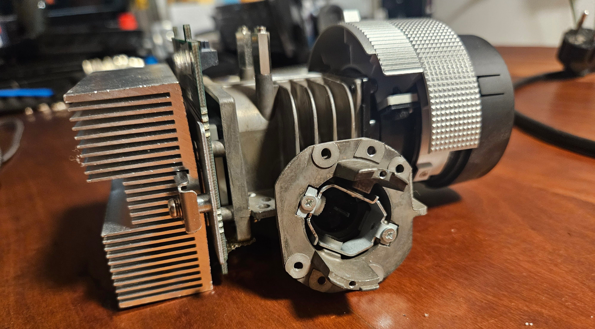
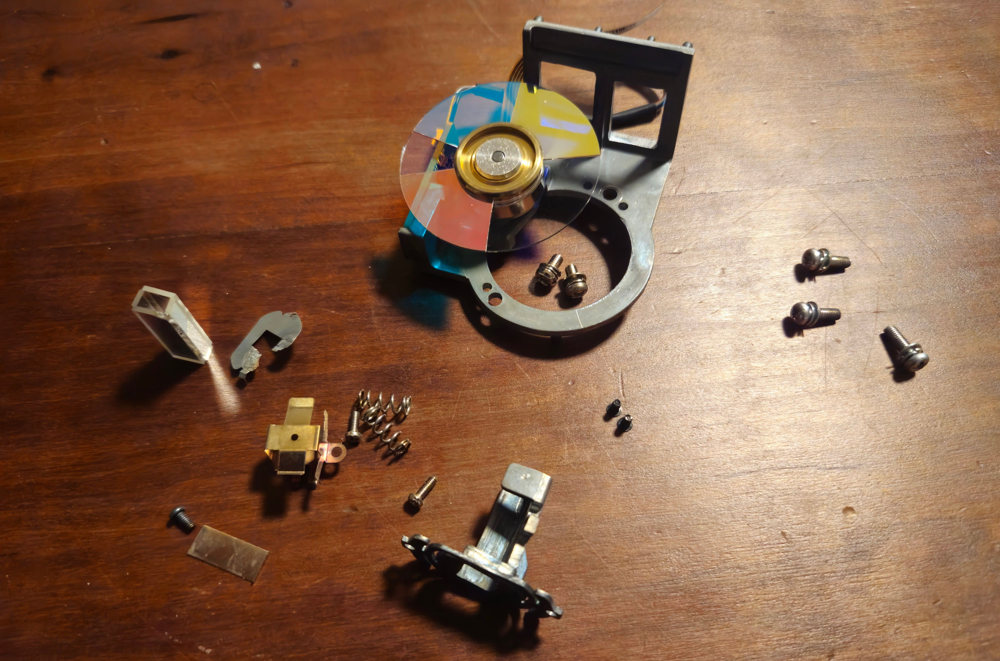
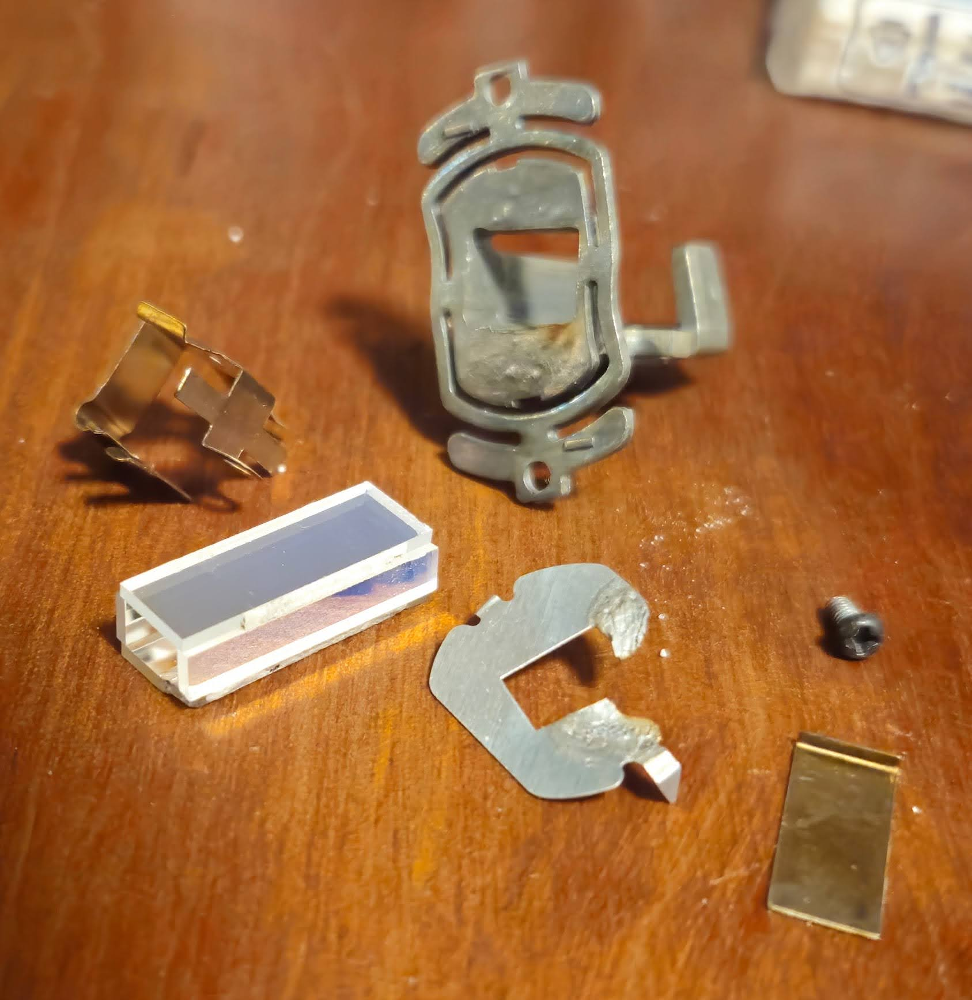
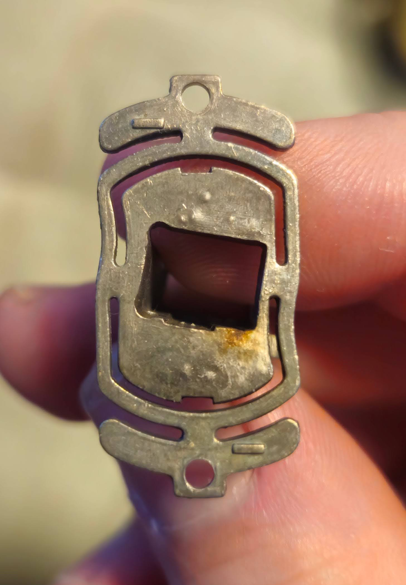
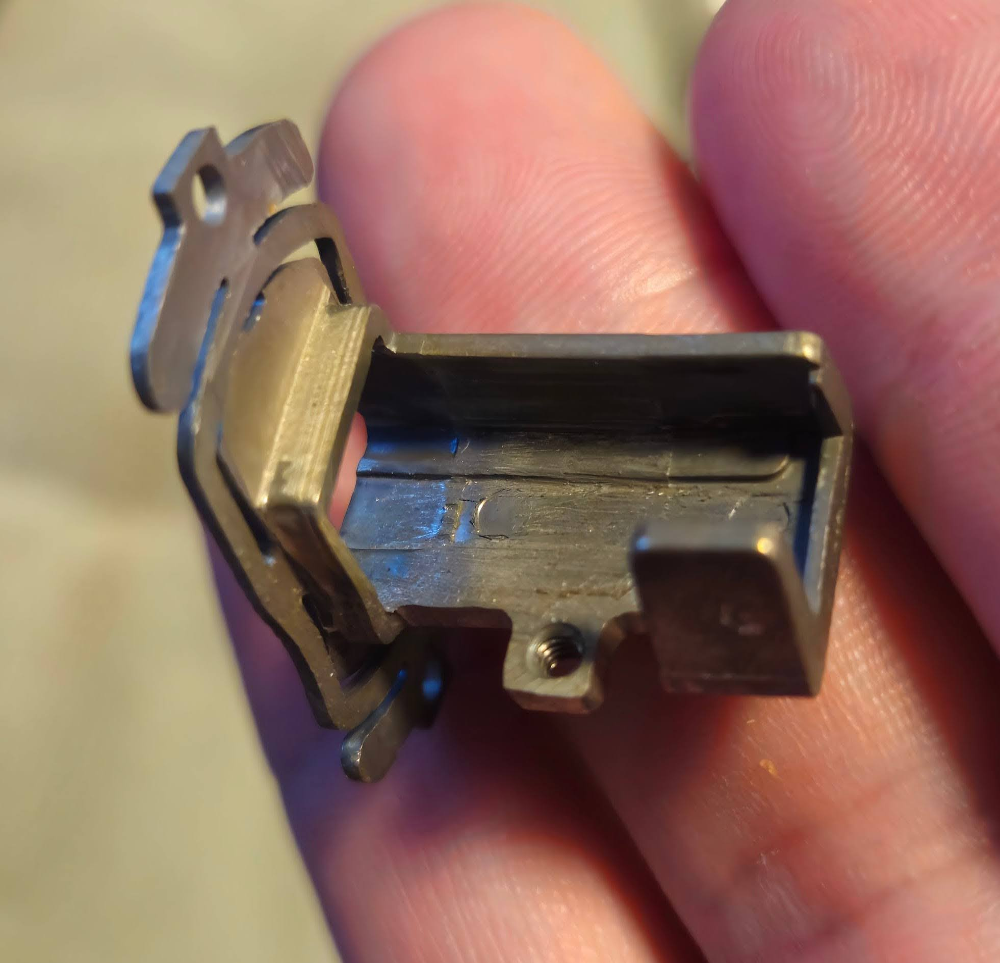
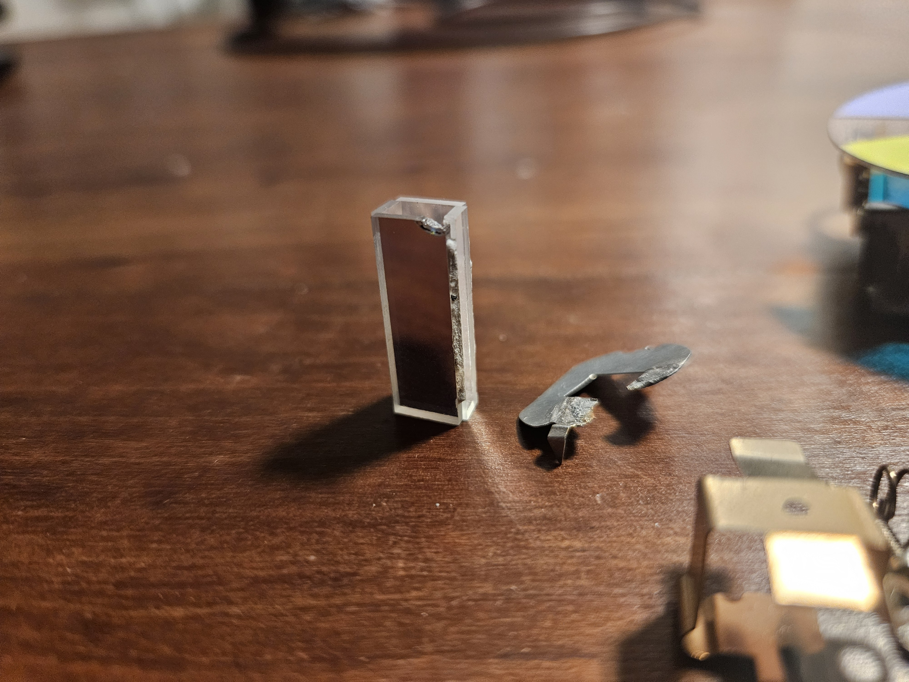
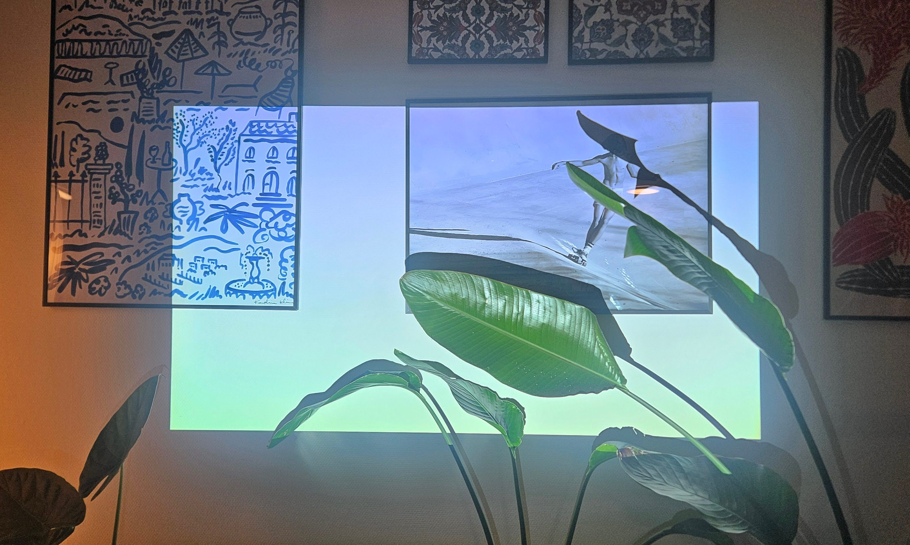

+++
draft = false
date = 2025-12-30T17:32:39+02:00
title = "Repairing a DLP projector"
description = ""
slug = "repairing-a-dlp-projector"
author = "Bernhard Frick"
tags = ["BenQ", "MH740", "DLP", "Projector", "Repair", "Light tunnel", "Lamp adjustment"]
categories = ["Repair"]
externalLink = ""
series = []
+++

Quite a while ago I rescued a barely used BenQ MH720 DLP projector with ~180
lamp hours from going to the trash because it had a dark shadow on the left side
of the screen. However, I never took the time to have a closer look at the
problem, and it sat on a shelf for years - until this weekend.

Upon turning it on, I was greeted with the following image (sorry for the lack
of projection screen, I did not have a big enough white wall close by my work
desk):

What was curious is that in the top left corner, the browser tabs, url bar and
bookmarks are still faintly visible.

## The lamp

Overall, the image seemed well illuminated, so the lamp must still work. Still,
I took it out to have a closer look. The lamp itself seemed perfectly fine to my
untrained eye, so I decided to play with the angle alignment screw on the lamp
cartridge to see if that made a difference.

This led to a very interesting discovery - the image suddenly became a lot
brighter, so much in fact that it almost hurt my eyes and I got scared that
something was wrong and would cause further damage. Luckily, a quick google
search told me that the lamp angle should be set for maximum brightness of the
projected image, otherwise the powerful beam might hit the edge of other optical
components and damage them.

Tracing along the supposed light path, it seems that damage has indeed occurred
from misalignment of the lamp:

At that point I had no idea what I was looking at, but what I saw did not seem
right. The damaged part was not accessible from the cartridge compartment, so
disassembly was necessary - another first for me.

## Disassembly

Taking apart a projector was a scary undertaking, as I did not know whether I
would encounter delicate optics that require special knowledge to deal with.
Luckily for me, all the sensitive optical components are enclosed in one single,
solid cast iron part and this turned out to be more or less just a standard
electronic device repair. At this point I should give credit to
[FixitFrank](https://www.youtube.com/@FixitFrank) on YouTube, whose videos on
projector repair helped me a lot to pull this of.

With that out of the way, lets get into the nitty-gritty of this repair. Here is
the general schematic of a DLP projector:

The light starts at the lamp, passes through the color wheel and the light
tunnel ("Integrator Rod"), then through some lenses ("Relay Optics"), gets
reflected ("Folding Mirrors") onto the DMD (digital micromirror device), and
goes out through the projection lens from there. We are going to focus on the
color wheel and light tunnel components, just before the main projection unit
that contains all the lenses and mirrors. Both the color wheel and light tunnel
are fairly fragile components made out of glass, and require delicate handling.
Same as with the lamp, avoid touching them with bare fingers to not leave behind
any fat stains that might cause damage. If you do, use isopropyl alcohol to
carefully clean them.

To get to the light tunnel, the color wheel needs to come off. But the color
wheel is fixed to the main unit, so the main unit has to come out in its
entirety. Here you can see the main unit with the color wheel and light tunnel
already removed. On the left is the cooler for the DMD, and on the right is the
projection lens with zoom and focus rings accessible from the outside:

The light tunnel sits inside the small tube in the center of the picture, held
in place by two springs and two screws for x-y-axis adjustment. The color wheel
is screwed onto the cast iron tube that contains the light tunnel. Above the
color wheel, you can see a row of pins that help guide the lamp cartridge into
correct alignment and hold it in place:

Below, you can see the component that contains the actual light tunnel, and
provides compliant mounting points for adjusting the direction of the light
tunnel:

  
   
  

## The root cause

After taking all of it apart, the damage becomes more clear: it seems that the
lamp misalignment that we discovered earlier burned away parts of something that
looks like a heat shield. Then, the beam must have heated up the light tunnel
assembly, and thermal expansion caused to be out of alignment. Additionally,
even the corner of the glass of the light tunnel seemed to have been molten
under the extreme heat!

The light tunnel consists of four flat optical mirrors, glued together with some
sort of extremely heat-resistant cement. Unfortunately, the integrity of the
cement was also compromised, and one of the four sides became loose and
misaligned during disassembly.

## Replacing the light tunnel

Re-gluing the light tunnel would have required specialized equipment to get the
distances and angles right, so instead I decided to try and order a new one
online. After doing some research, I found a seller on ebay that has a variety
of light tunnels in stock (https://www.ebay.com/str/lampbook). None mentioned my
projector model as a compatible device, but an offer for a BenQ TH683 seemed to
match the exact dimensions I was looking for. The seller was very helpful and
confirmed that everything should be fine if the dimensions match, since in the
end it's just a bunch of mirrors. US $15.00 excl. shipping and two weeks later I
had a new light tunnel in my hands, and could finally start putting the
projector back together.

## Assembly and alignment

During reassembly, the light tunnel needs to be aligned correctly - this step is
correcting for the issue that we saw in the very beginning. The screws for
aligning the light tunnel are located on the outside of the cast iron tube that
the light tunnel sits in. The up-down adjustment screw is easy to reach from the
top, but the left-right adjustment screw is difficult to reach when the device
is assembled so that it can be powered on. At the same time, a powerful light
source is required to verify the correct alignment. To work around this, I used
the strongest flashlight I could find, held it against the light tunnel and
looked into the projector lens where now a faint outline of the rectangular
DMD was visible. This was a bit tricky because it would be done easier with
three hands, but in the end I was able to get left-right axis adjusted so that
there were no dark shadows on either side. The up-down adjustment was then done
with the projector lamp after it was fully assembled.

The very last step was to again align the projector lamp, now that the light
tunnel was seated and aligned correctly. Bonus fact: The projector was
displaying a pure white image in this picture. DLP projectors with color wheels
project each color for a single frame in sequence. Combined with the shutter
speed of a camera, the individual colors can become visible, which is what
happened here.

## Links

* [Data sheet BenQ MH740](MH740_Data_sheet_EN.pdf)
* [User Manual BenQ MH740](MH740_User_Manual_EN.pdf)
* [Replacement lamp: Part Number 5J.J8805.001](https://www.benq.eu/nl-nl/accessory/lamps/sx912-lamp.html)
* [FixitFrank](https://www.youtube.com/@FixitFrank) on YouTube:
  * [DLP Projector Light Tunnel Example and Alignment](https://www.youtube.com/watch?v=IMeZIKnhy-A)
  * [Optoma GT1080 DLP Projector Repair / Light Tunnel Adjustment](https://www.youtube.com/watch?v=JeZ6tMTeToc)
